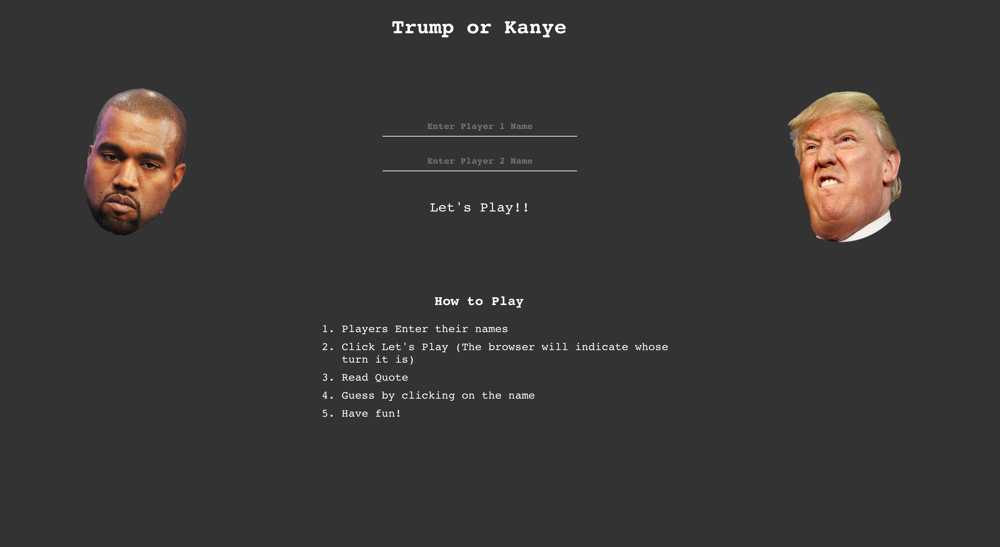

# Who Said it? Trump or Kanye

## Requirements

This React web app was built with the 'Kanye.rest' and the 'What does Trump Think API'. These were open APIs with no authentication required. These can be found here:

### What Does Trump Think:

https://whatdoestrumpthink.com/api-docs/index.html#introduction

### Kanye API:

https://kanye.rest/

## Introduction

The purpose of this project was to utilize and build on knowledge of React through the integration of APIs to build a game where a User can interact with the API through the quotes that have been rendered on the screen and guessing whether Trump or Kanye had quoted it.

## Landing Page

This is what the landing page of the web app. To play this game, it requires two players to enter a name.

